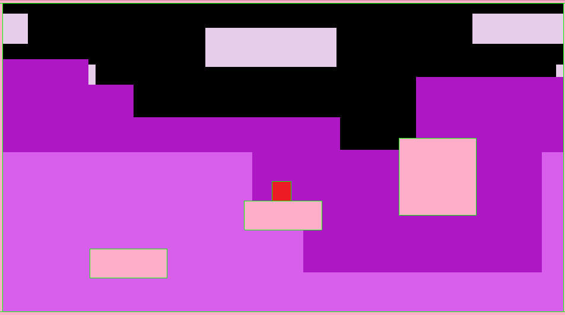
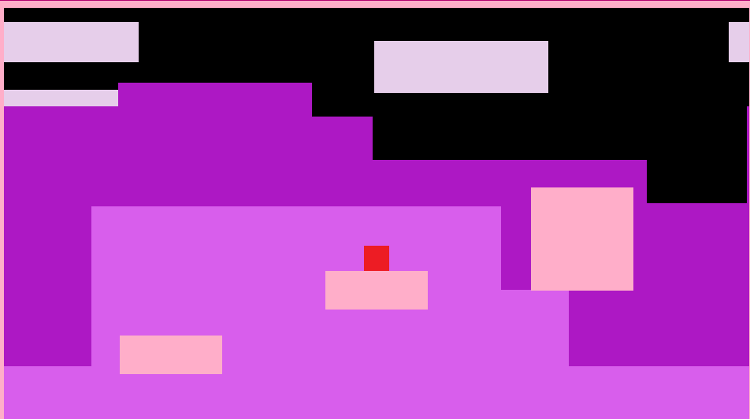
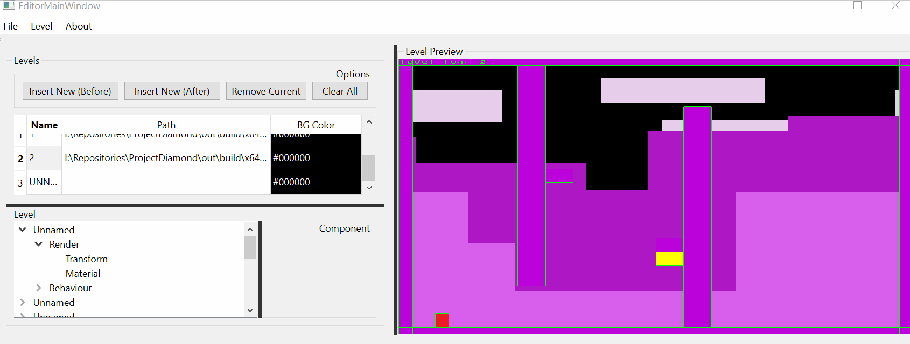
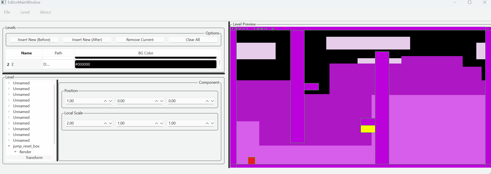

# Project Diamond

After having spent years developing my own [custom game engine](https://github.com/KarimTakieddine/DiamondEngine), I decided it might finally be time to start using it to prototype games. Another time skip, and here we are! This project makes use of the engine features as a submodule and a static library to both extend the framework by building custom components and developing levels showcasing these during gameplay.

Being a fan of 2D platformers, the current idea at the time of writing is to build the necessary tools to build fun levels and game mechanics.

## Features

- 2D Platforming at its finest :)

- A fully functional level editor developed with the [Qt Open Source UI library](https://www.qt.io/download-open-source)

## License

[MIT](https://opensource.org/license/mit)

Copyright 2025 Karim Takieddine

Permission is hereby granted, free of charge, to any person obtaining a copy of this software and associated documentation files (the “Software”), to deal in the Software without restriction, including without limitation the rights to use, copy, modify, merge, publish, distribute, sublicense, and/or sell copies of the Software, and to permit persons to whom the Software is furnished to do so, subject to the following conditions:

The above copyright notice and this permission notice shall be included in all copies or substantial portions of the Software.

THE SOFTWARE IS PROVIDED “AS IS”, WITHOUT WARRANTY OF ANY KIND, EXPRESS OR IMPLIED, INCLUDING BUT NOT LIMITED TO THE WARRANTIES OF MERCHANTABILITY, FITNESS FOR A PARTICULAR PURPOSE AND NONINFRINGEMENT. IN NO EVENT SHALL THE AUTHORS OR COPYRIGHT HOLDERS BE LIABLE FOR ANY CLAIM, DAMAGES OR OTHER LIABILITY, WHETHER IN AN ACTION OF CONTRACT, TORT OR OTHERWISE, ARISING FROM, OUT OF OR IN CONNECTION WITH THE SOFTWARE OR THE USE OR OTHER DEALINGS IN THE SOFTWARE.
